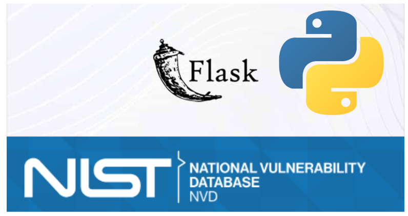

CVE TRACKER

 

This project contains a simple Flask application that fetches security vulnerabilities from the National Vulnerability Database (NVD) and displays them to the user.

## Installation

1. Clone the project:
2. Navigate to the project directory to set up:

    ```
    cd cve_search
    ```

3. Start the application by running the following command:

    ```
    python app.py
    ```

4. You can view the application by visiting `http://localhost:5000` in your browser.

## Usage

- On the main page, you can see security vulnerabilities fetched from the NVD.
- Page pagination is available at the bottom of the page. Each page lists 20 security vulnerabilities.
- You can search for a specific vulnerability by entering a CVE number in the search box.

## Contributing

To contribute, please submit a pull request or open an issue. Any contributions and feedback are appreciated.

## License

This project is licensed under the MIT License. See the [LICENSE](LICENSE) file for more information.
